# Active Directory Security Lab


A hands-on Active Directory lab built from scratch to simulate realistic attack scenarios and practice defensive detection and hardening. Covers credential theft, Kerberos abuse, and lateral movement — then analyzes how (and how hard) each attack is to detect with native Windows logging.

---

## Lab architecture

```
VirtualBox — Internal Network: LabNet
┌─────────────────────────┐     ┌─────────────────────────┐
│  Windows Server 2019    │     │  Windows 10 Client      │
│  Domain Controller      │◄────│  (joined to lab.local)  │
│  lab.local              │     │  local admin: client    │
└─────────────────────────┘     └─────────────────────────┘
         │                                  │
         └──────────── NAT ─────────────────┘
                  (internet access)
```

Both VMs share an internal network (`LabNet`) with no external exposure, plus a NAT adapter for updates and tool downloads.

---

## Active Directory structure

```
corp.local
├── OU: Finance
│   ├── finance1        (standard user)
│   └── sqlservice      (standard user — has a registered SPN)
└── OU: IT
    └── it1             (standard user)

Security group: LabUsers (Finance + IT members)
```

`sqlservice` has a Service Principal Name (SPN) registered to simulate a service account — intentionally making it a Kerberoasting target.

---

## Attack scenarios

### 1. Kerberoasting — harvesting a service ticket as a standard user

**What:** Any authenticated domain user can request a Kerberos service ticket for any account with an SPN. That ticket is encrypted with the service account's password hash — and can be cracked offline.

**What I did:**
- Attempted `klist` / native ticket request as `it1` → access denied (not admin)
- Used **Rubeus** from the client machine as `it1` (standard user — no elevated privileges needed)
- Rubeus successfully extracted the TGS ticket for `sqlservice`
- Cracked the ticket hash offline → recovered password: `Password123`

**Why it worked:** Kerberoasting requires zero special privileges — any domain user can request service tickets. The vulnerability is entirely in the weak password of the service account.

**Detection difficulty: Hard with native logs alone**

Event ID 4769 (Kerberos Service Ticket Request) is generated — but every normal user generates dozens of these daily. Without a baseline and anomaly detection (unusual account requesting tickets for many SPNs, off-hours requests), 4769 alone is noise.

| Event ID | What it shows | Usefulness |
|---|---|---|
| 4769 | Service ticket requested | Low — normal activity looks identical |

> **Defensive takeaway:** Service accounts need strong, randomly generated passwords (>25 chars). Managed Service Accounts (MSA) or Group Managed Service Accounts (gMSA) rotate passwords automatically — eliminating Kerberoasting entirely.

---

### 2. Credential Dumping with Mimikatz — from local admin to NTLM hash

**What:** Mimikatz can extract credentials cached in LSASS memory. It requires local administrator privileges on the target machine.

**What I did:**

1. Enumerated local admins on the client machine:
   ```powershell
   net localgroup Administrateurs
   ```
   Found: `client` (the local admin account used to join the machine to the domain)

2. Switched to the `client` account (password: `client`) and ran Mimikatz — got session metadata (usernames, logon times, domains) but **no NTLM hashes** for domain accounts

3. Understood why: NTLM hashes are only cached in LSASS after an interactive network authentication. The domain admin hadn't logged in from this machine yet.

4. Simulated the realistic scenario: connected to the client machine **as the domain admin** (as an admin would do to perform a quick task), then switched back to `client` and re-ran Mimikatz

5. Result: **domain admin NTLM hash recovered** — visible in screenshots

**Why it worked:** The moment a privileged account authenticates on a machine, its credentials are cached in LSASS. Any local admin on that machine can then extract them. This is the most common lateral movement vector in real enterprise breaches.

**Detection difficulty: Medium**

| Event ID | What it shows |
|---|---|
| 4624 | Successful logon (admin connecting to the machine) |
| 4648 | Explicit credential use (someone authenticating with alternate credentials) |

Event 4648 is the most interesting here — it flags when a process uses credentials different from the current session, which is exactly what happens during Pass-the-Hash or when an attacker uses stolen credentials.

> **Defensive takeaway:** This attack is fundamentally an **operational security failure**, not a Windows flaw. Windows does not fully expose NTLM hashes unless an admin logs in interactively. The fix is never logging into standard workstations with domain admin accounts — use **Privileged Access Workstations (PAW)** and the principle of least privilege. Credential Guard (Windows 10+) also prevents LSASS dumping by isolating it in a virtualization-based security enclave.

---

### 3. Pass-the-Hash — authenticating without knowing the password

**What:** NTLM authentication doesn't require the plaintext password — only the hash. With a stolen NTLM hash, an attacker can authenticate as that user to any service accepting NTLM.

**What I did:**
- Used the domain admin NTLM hash recovered in step 2
- Ran a Pass-the-Hash command → opened a PowerShell session authenticated as domain admin
- Confirmed access: full domain admin privileges without ever knowing the plaintext password

**Detection difficulty: Hard**

| Event ID | What it shows |
|---|---|
| 4624 | Successful logon — looks identical to a legitimate admin login |
| 4648 | Explicit credential use |

Pass-the-Hash is nearly invisible in native logs because a successful NTLM authentication looks the same whether it used a password or a hash. Detection requires correlating the logon with the originating machine and flagging admin accounts authenticating from unexpected hosts.

> **Defensive takeaway:** Disabling NTLM in favor of Kerberos-only authentication eliminates Pass-the-Hash entirely. Where NTLM cannot be disabled, restricting admin accounts with Protected Users security group forces Kerberos and prevents NTLM fallback.

---

## Detection & audit configuration (GPO)

Configured via Group Policy to enable advanced auditing:

| Policy | Setting | Detects |
|---|---|---|
| Audit Logon Events | Success + Failure | 4624, 4625, 4648 |
| Audit Kerberos Service Ticket Operations | Success + Failure | 4768, 4769 |
| Account Lockout | 5 failed attempts → lockout | Brute force |
| Password Policy | Configured (not enforced in lab) | Weak credentials |

**Key observation:** Even with full auditing enabled, Kerberoasting and Pass-the-Hash generate events that are indistinguishable from legitimate activity at the individual event level. Effective detection requires **volume analysis, behavioral baselines, and correlation** — which is why SIEM tools exist. Native Event Viewer alone is insufficient for a production environment.

---

## Key takeaway — the human factor

The most important lesson from this lab: **Windows is not the weakest link**.

Every attack in this lab required at least one operational mistake:
- A service account with a weak, guessable password → enables Kerberoasting
- A local admin account with the password `client` → enables initial access to Mimikatz
- A domain admin authenticating interactively on a standard workstation → exposes the NTLM hash

Without these mistakes, none of the attacks succeed. This matches the real-world threat model: most breaches don't exploit zero-days — they exploit misconfiguration, weak credentials, and privilege hygiene failures. Defense is 80% process and policy, 20% technology.

---

## Screenshots

### AD Structure
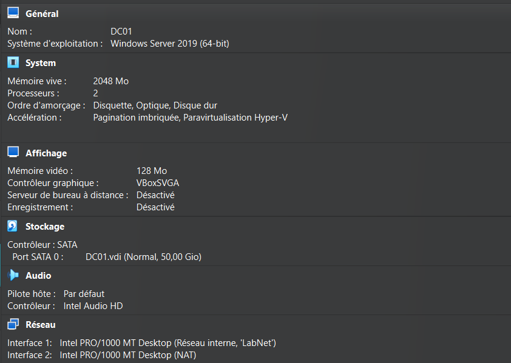
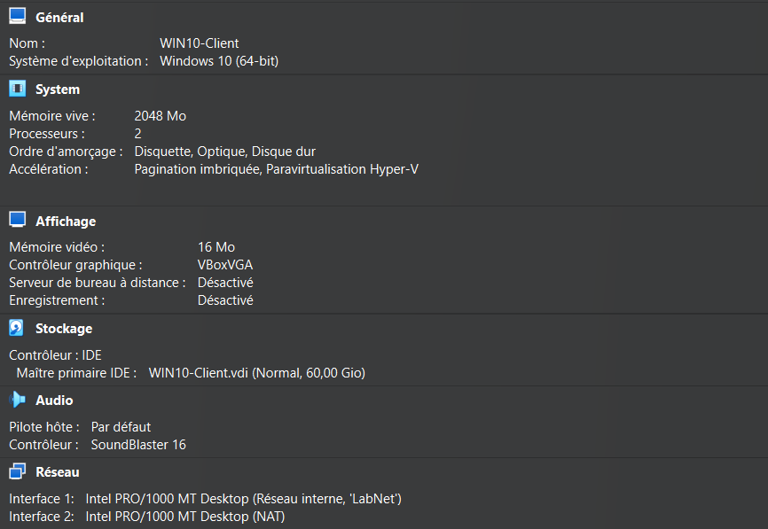
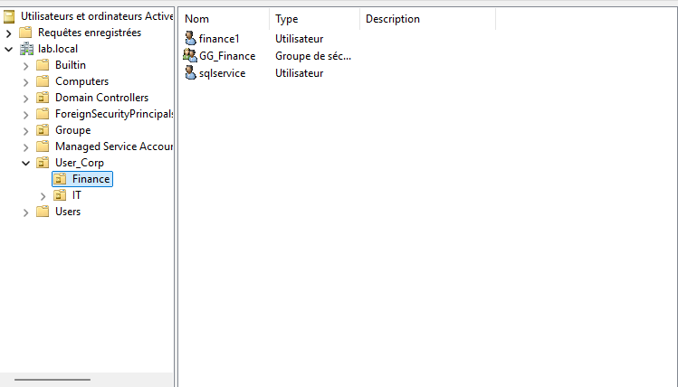
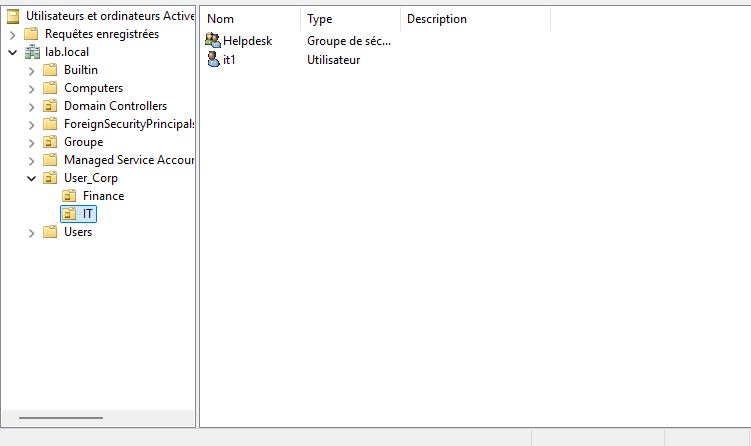

### Kerberoasting
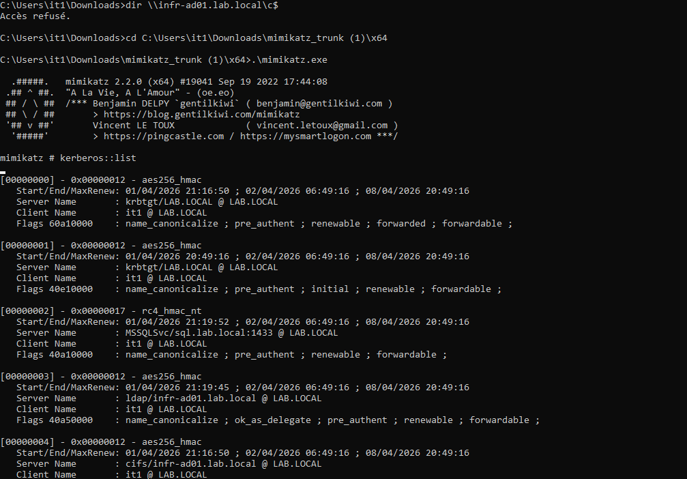
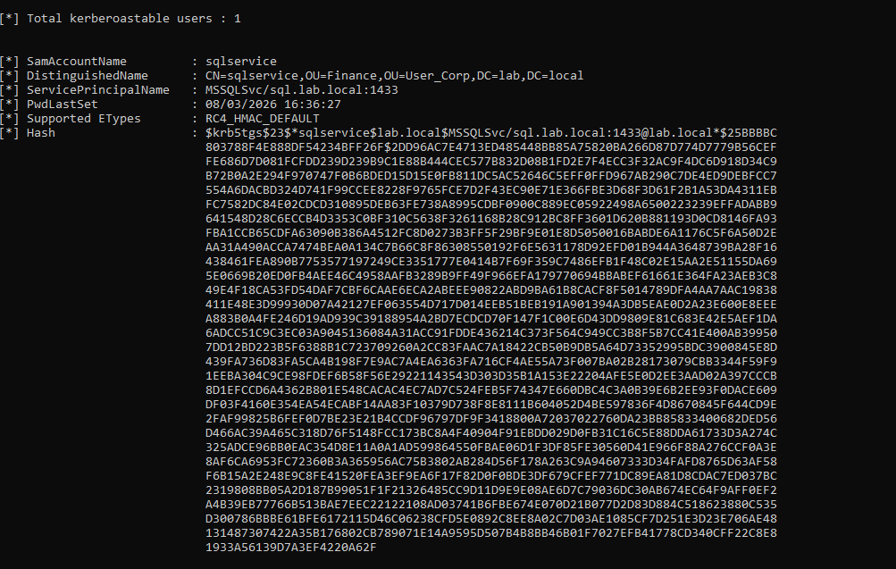
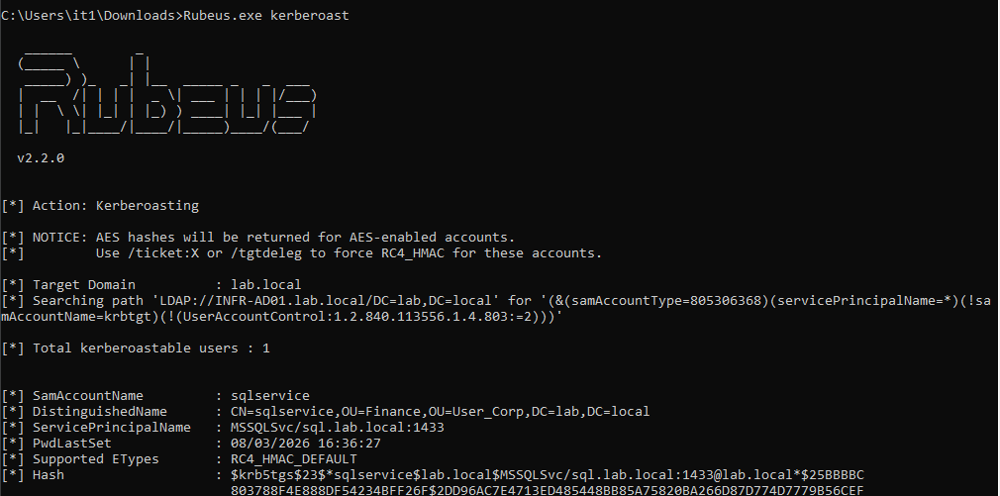

### Mimikatz
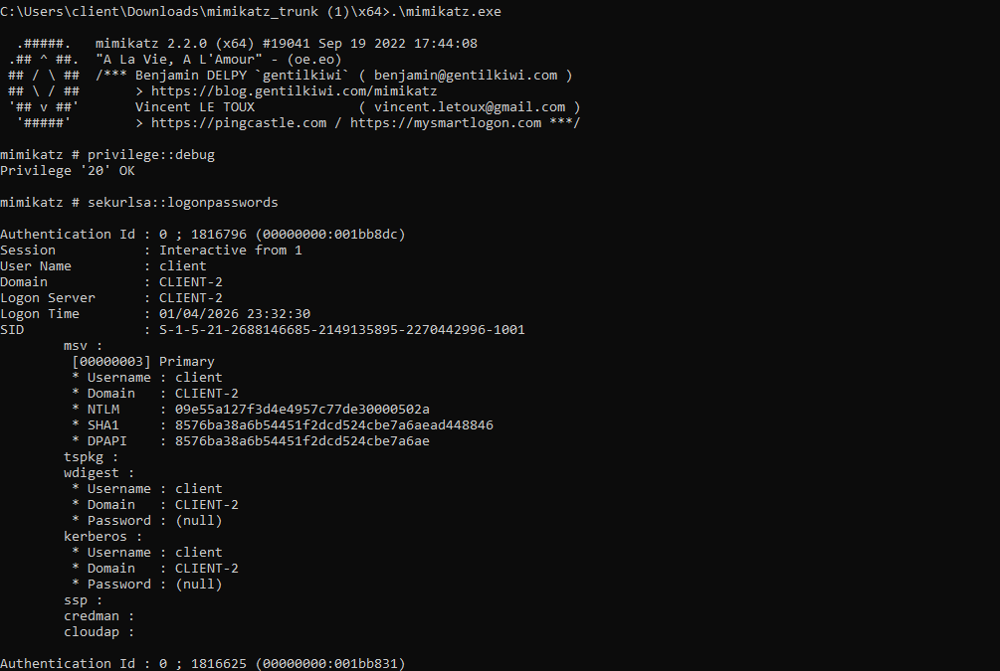
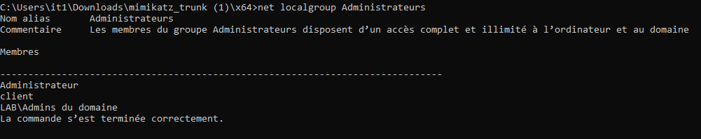
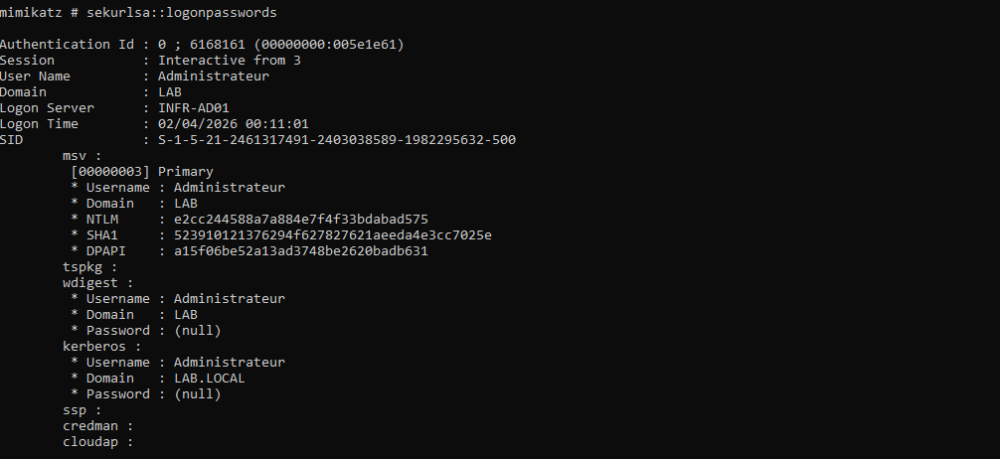

### Pass-the-Hash
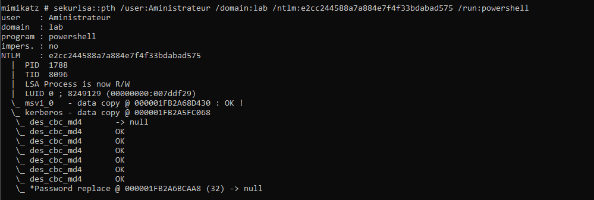

### Events Viewer logs


### GPO — Audit & Hardening
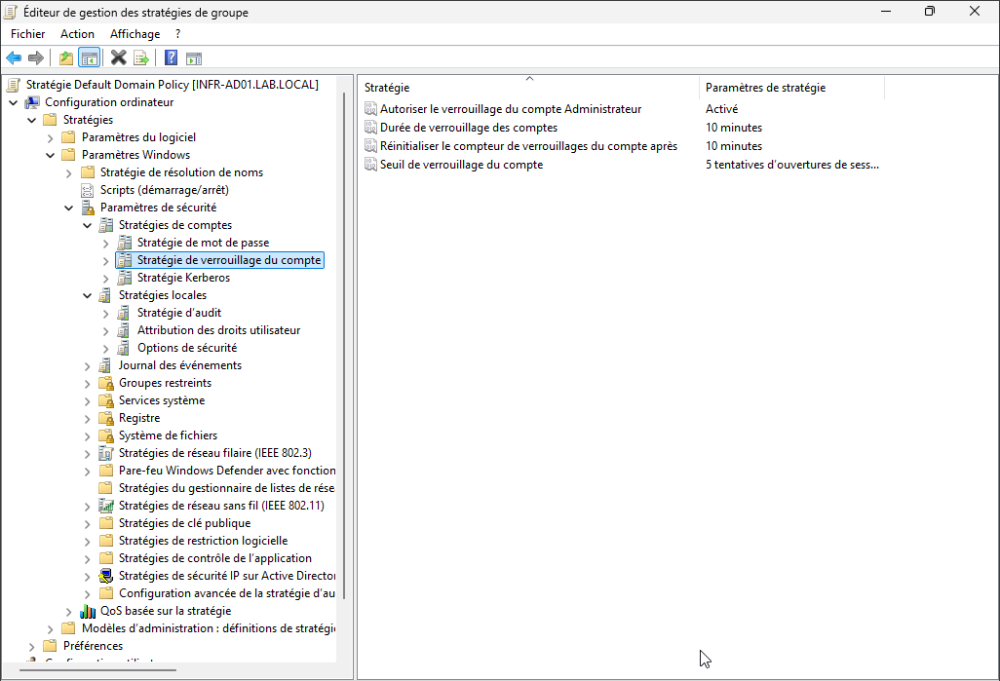
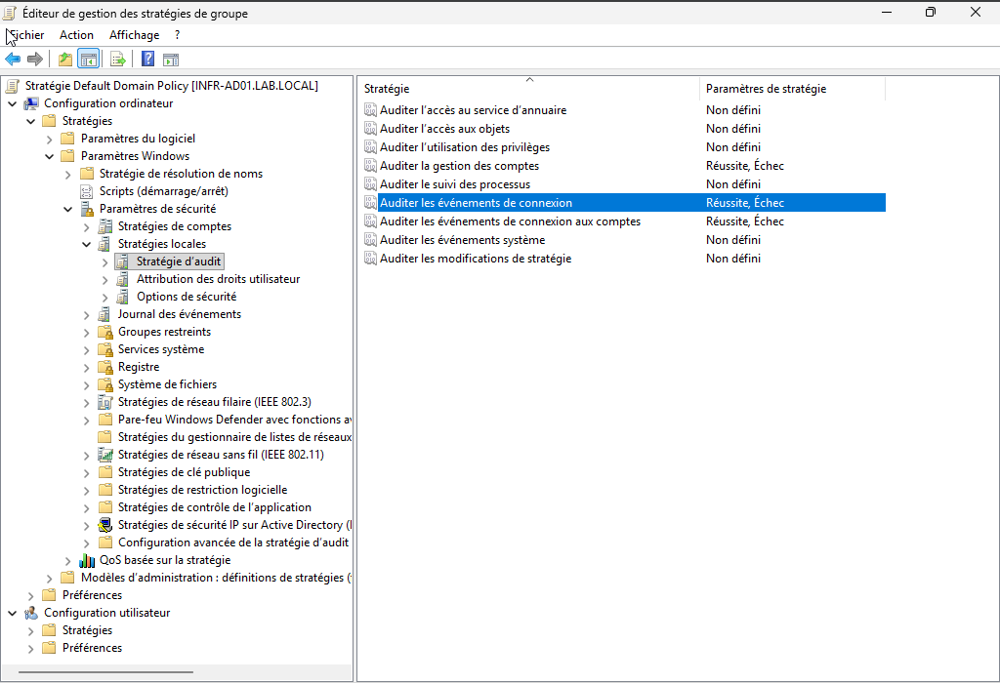
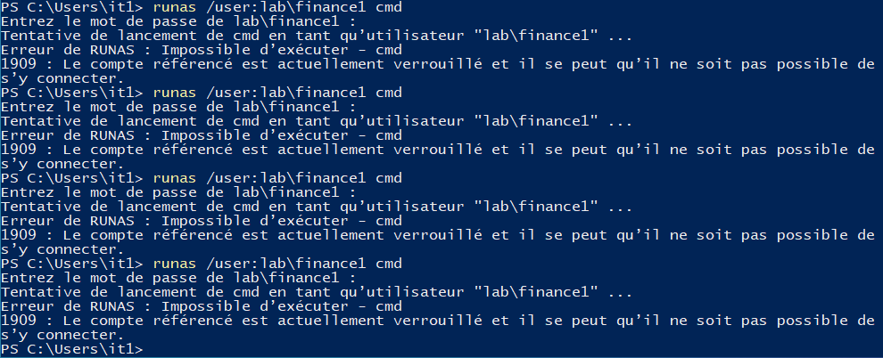

---

## Tools used

| Tool | Purpose |
|---|---|
| Windows Server 2019 | Domain Controller |
| VirtualBox | Lab virtualization |
| PowerShell | AD administration, enumeration |
| Rubeus | Kerberoasting — TGS ticket extraction |
| Mimikatz | LSASS credential dumping |
| Windows Event Viewer | Log analysis — 4624, 4648, 4769 |
| Group Policy Editor | Audit configuration, hardening |